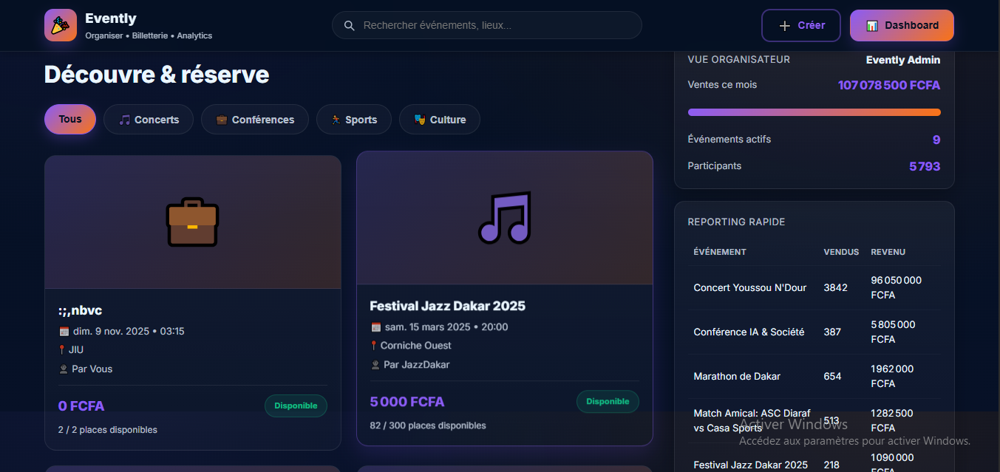
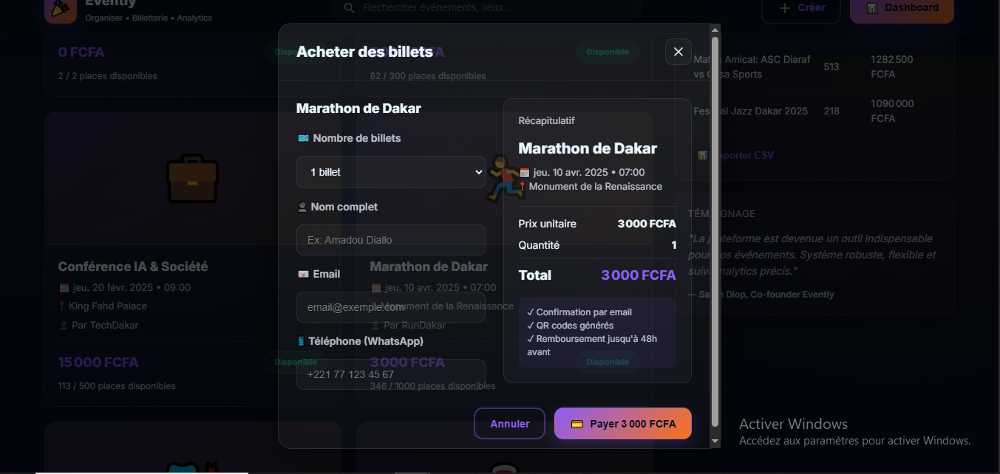
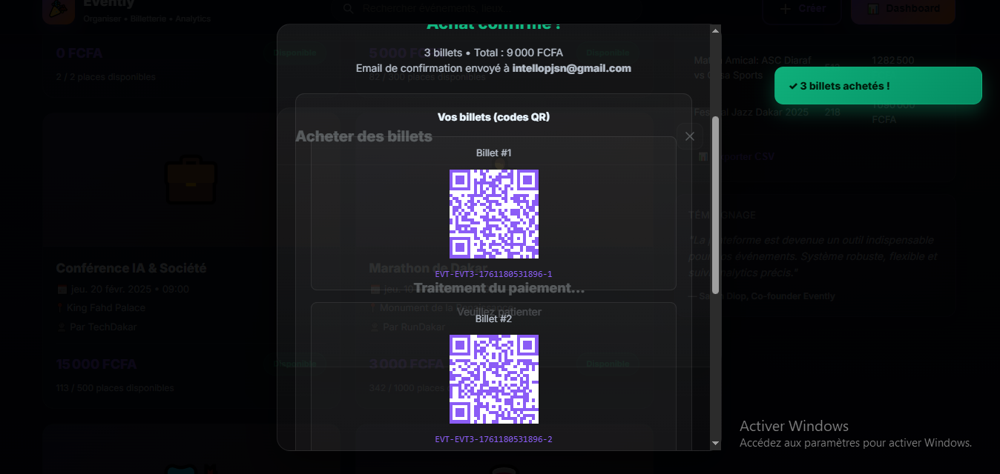
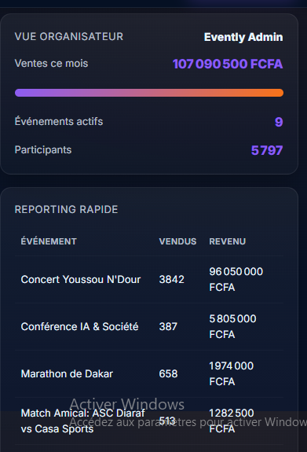
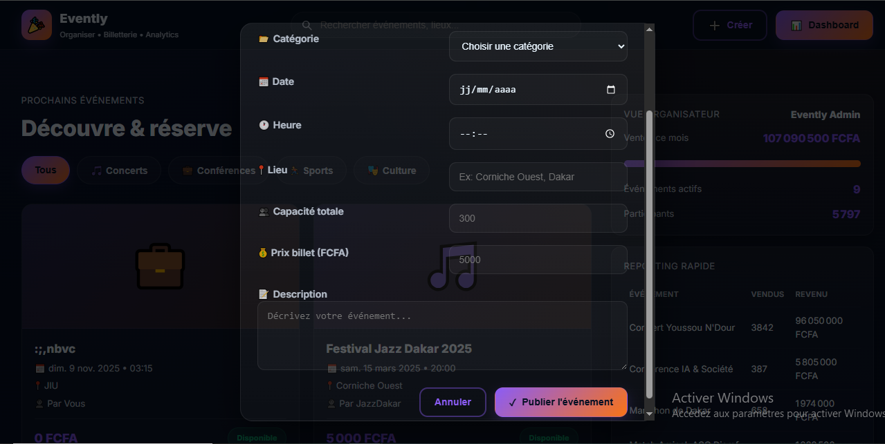

# 🎉 Evently — Plateforme Événementielle

[](https://github.com/intello-agence)
[](./LICENSE)
[](https://developer.mozilla.org/fr/docs/Web/HTML)
[](https://developer.mozilla.org/fr/docs/Web/CSS)
[](https://developer.mozilla.org/fr/docs/Web/JavaScript)
[](https://www.chartjs.org/)
[](https://davidshimjs.github.io/qrcodejs/)

> **Prototype premium de plateforme événementielle**  
> Création d'événements, billetterie en ligne, QR codes, dashboard organisateur avec analytics

---

## 📋 Vue d'ensemble

**Evently** est un prototype complet de plateforme de gestion d'événements et de billetterie en ligne. Il démontre une expérience utilisateur moderne avec :

- 🎨 **Design glassmorphism** violet/orange événementiel
- 📱 **Responsive** (mobile-first)
- ♿ **Accessibilité WCAG 2.1 AA** (ARIA, focus-visible, skip link, sr-only)
- 🔒 **Sécurité** (validation stricte, escapeHTML, pas de eval)
- 🎫 **QR codes dynamiques** (QRCode.js)
- 📊 **Analytics temps réel** avec Chart.js (prévu)
- 💾 **Export CSV** des ventes

---

## ✨ Fonctionnalités

### 🧑‍💼 Vue Public

#### Grille d'événements
- **8 événements** fictifs répartis en 5 catégories
- **Filtrage dynamique** par catégorie (boutons avec `aria-pressed`)
- **Recherche globale** debounced (300ms) : titre, lieu, organisateur
- **Cards événements** cliquables avec :
  - Emoji catégorie
  - Date/heure/lieu
  - Prix en FCFA
  - Jauge de capacité (Disponible, Bientôt complet, Complet)
  - Places restantes

**Catégories** :
- 🎵 Concerts (Festival Jazz, Youssou N'Dour)
- 💼 Conférences (IA & Société, Atelier Photo)
- 🏃 Sports (Marathon, Match football)
- 🎭 Culture (Exposition arts)
- 🍷 Food & Nightlife (Dégustation Thiébou Dieune)

#### Achat de billets
- **Modal achat** avec formulaire sécurisé :
  - Sélection quantité (max 10 ou places restantes)
  - Coordonnées : nom, email, téléphone (validation regex Sénégal)
  - Récapitulatif dynamique (prix total mis à jour en temps réel)
- **Validation stricte** :
  - Nom min 2 caractères
  - Email format valide
  - Téléphone : `/^(\+221|00221)?\s?\d{2}\s?\d{3}\s?\d{2}\s?\d{2}$/`
  - Vérification capacité restante
- **Simulation paiement** (loader 1.8s)
- **Génération QR codes** (QRCode.js) :
  - 1 QR code par billet
  - Code unique : `EVT-{ID}-{TIMESTAMP}-{N}`
  - Affichage visuel dans modal confirmation
- **Toast confirmation** : "✓ X billet(s) acheté(s) !"

#### Parcours utilisateur
```
Clic événement → Modal achat
→ Saisie coordonnées
→ Validation
→ Loader paiement
→ Modal confirmation + QR codes
→ Toast succès
→ MAJ KPIs organisateur
```

---

### 👨‍💼 Vue Organisateur (Dashboard)

#### KPIs en temps réel
- **Ventes ce mois** (somme revenus en FCFA)
- **Progress bar** objectif 20M FCFA (gradient violet/orange)
- **Événements actifs** (compteur)
- **Participants** (somme billets vendus)

#### Tableau de reporting
- **Top 5 événements** par revenus
- Colonnes : Événement, Vendus, Revenu
- Trié par revenus décroissants

#### Création d'événement
- **Formulaire complet** (modal) :
  - Titre (min 3 caractères, max 100)
  - Catégorie (select 5 options)
  - Date (input date, validation future)
  - Heure (input time)
  - Lieu (min 3 caractères, max 200)
  - Capacité (number, min 1, max 100000)
  - Prix (number, min 0, FCFA)
  - Description (textarea, min 10 caractères, max 1000)
- **Validation complète** :
  - Tous champs obligatoires
  - Date future obligatoire
  - Emoji automatique selon catégorie
- **Ajout dynamique** : événement créé en haut de liste

#### Export CSV
- **Bouton export** → téléchargement instant
- **BOM UTF-8** pour Excel
- Colonnes : Événement, Catégorie, Date, Vendus, Capacité, Revenu
- Nom fichier : `evently-rapport-AAAA-MM-JJ.csv`

---

## 📸 Screenshots

### Interface Public


*Hero, grille événements avec filtres catégorie et recherche*


*Formulaire achat + récapitulatif dynamique*


*Modal confirmation avec QR codes générés*

### Dashboard Organisateur


*KPIs, progress bar, reporting rapide*


*Formulaire création avec validation complète*

---

## 🚀 Installation

### Prérequis
- Navigateur moderne (Chrome, Firefox, Safari, Edge)
- Serveur local (pour éviter CORS) ou ouvrir directement `index.html`

### Étapes

```bash
# Cloner le repo
git clone https://github.com/intello-agence/event-platform.git
cd event-platform

# Option 1 : Serveur local Python
python3 -m http.server 8000
# Puis ouvrir http://localhost:8000

# Option 2 : Live Server (VS Code)
# Clic droit sur index.html → "Open with Live Server"

# Option 3 : Ouvrir directement
open index.html
```

### Fichiers principaux
```
event-platform/
├── index.html          # Structure HTML sémantique
├── styles.css          # Design glassmorphism + a11y
├── app.js              # Logique métier (IIFE strict)
├── screenshots/        # Captures d'écran
│   ├── events_public_grid.png
│   ├── event_ticket_purchase.png
│   ├── ticket_confirmation_qr.png
│   ├── dashboard_organizer_sidebar.png
│   └── event_creation_form.png
└── README.md
```

---

## 🏗️ Structure du projet

### HTML (`index.html`)
- **SEO light** : meta robots noindex, description, author
- **Skip link** : `#mainContent` (visible au focus)
- **ARIA** :
  - `role="dialog"` + `aria-modal="true"` sur modals
  - `aria-labelledby` sur sections/modals
  - `aria-live="polite"` sur grille événements, KPIs, toasts
  - `aria-pressed` sur filtres catégorie
  - `role="progressbar"` sur barre progression
- **Formulaires sécurisés** :
  - Labels `for`/`id` associés
  - `autocomplete`, `required`, `minlength`/`maxlength`, `min`/`max`
  - `novalidate` (validation custom JS)
- **Libs en defer** : Chart.js, QRCode.js (sans SRI)

### CSS (`styles.css`)
- **Variables CSS** (`:root`) : palette violet/orange événementiel
- **Utilitaires a11y** :
  - `.skip-link` (visible au focus)
  - `.sr-only` (screen reader only)
  - `*:focus-visible` (outline accent)
  - States `:disabled`
  - Support `aria-pressed`
- **Responsive** :
  - Breakpoints : 1024px, 768px
  - Grilles adaptatives (`grid-template-columns: repeat(auto-fill, ...)`)
  - Main-grid : 2 cols desktop → 1 col mobile
- **Performance** :
  - `will-change` sur `.toast`, `.modal.active`
  - `@media (prefers-reduced-motion: reduce)`
- **Animations GPU** : `@keyframes slideIn`

### JavaScript (`app.js`)
- **IIFE** + `'use strict'`
- **State centralisé** : events, eventsFiltered, categorieActive, searchQuery, chart, currentEvent
- **Helpers** :
  - `escapeHTML()` : protection XSS sur toutes injections
  - `debounce()` : recherche (300ms)
  - `formatPrix()` : FCFA avec toLocaleString
  - `showToast()` : notifications accessibles (aria-live)
  - `formatDate()` : dates localisées français
- **Données fictives** :
  - 8 événements variés (concerts, conférences, sports, culture, food)
  - Capacités 30 à 5000 places
  - Prix 2000 à 25000 FCFA
- **Modals** :
  - Overlay cliquable
  - Fermeture ESC
  - `hidden` + `.active` (transitions CSS)
  - `aria-labelledby` dynamique
- **QRCode.js** :
  - Génération dynamique dans modal confirmation
  - Configuration : width/height 120px, colorDark violet, correctLevel M
  - 1 QR par billet avec code unique
- **Validation formulaires** :
  - Achat : nom (min 2), email regex, téléphone regex Sénégal, capacité
  - Création : titre (min 3), catégorie obligatoire, date future, lieu (min 3), description (min 10)
- **Export CSV** : BOM UTF-8, échappement doubles quotes
- **Filtres** :
  - Catégorie : tous/concerts/conferences/sports/culture/food
  - Recherche debounced sur titre/lieu/organisateur
  - Combinaison catégorie + recherche

---

## 🎨 Design System

### Palette de couleurs
| Variable          | Valeur                   | Usage                     |
|-------------------|--------------------------|---------------------------|
| `--bg-start`      | `#041023`                | Fond dégradé haut         |
| `--bg-end`        | `#071127`                | Fond dégradé bas          |
| `--surface`       | `rgba(255,255,255,0.03)` | Cartes glassmorphism      |
| `--surface-2`     | `rgba(255,255,255,0.06)` | Hover surfaces            |
| `--border`        | `rgba(255,255,255,0.08)` | Bordures subtiles         |
| `--text`          | `#eaf6ff`                | Texte principal           |
| `--muted`         | `rgba(230,240,255,0.76)` | Texte secondaire          |
| `--accent`        | `#8b5cf6`                | Violet principal (CTA)    |
| `--accent-2`      | `#f97316`                | Orange highlights         |
| `--accent-gradient` | `linear-gradient(135deg, #8b5cf6, #f97316)` | Dégradés |
| `--success`       | `#10b981`                | Toasts succès, badges     |
| `--danger`        | `#ef4444`                | Badge complet, erreurs    |
| `--warning`       | `#f59e0b`                | Badge bientôt complet     |
| `--info`          | `#06b6d4`                | Informations              |

### Typographie
- **Font** : Inter, system-ui fallback
- **Titres** : 900 (black), letterspacing ajusté
- **Corps** : 14px/1.5, antialiased
- **Hiérarchie** : h1 (32px) → h2 (20px) → h3 (18px)

### Espacements
- Container : `max-width: 1280px`, `padding: 0 24px`
- Sections : `margin-bottom: 48px`
- Grilles : `gap: 20px` (events), `gap: 16px` (sidebar)

### Effets
- **Glassmorphism** : `backdrop-filter: blur(12px)` + surfaces rgba
- **Box-shadow** : `0 8px 18px rgba(...)` sur CTAs
- **Hover** : `translateY(-2px)` + brightness(1.05)
- **Transitions** : `0.2s ease` (défaut), `0.3s` modals

---

## 🛠️ Stack Technique

| Technologie  | Version | Rôle                          |
|--------------|---------|-------------------------------|
| **HTML5**    | —       | Structure sémantique          |
| **CSS3**     | —       | Design glassmorphism          |
| **JavaScript**| ES6    | Logique métier (Vanilla)      |
| **Chart.js** | 4.4.0   | Analytics dashboard (prévu)   |
| **QRCode.js**| 1.0.0   | Génération QR codes billets   |

### CDN utilisés
```html
<!-- Chart.js (sans SRI) -->
<script defer src="https://cdn.jsdelivr.net/npm/chart.js@4.4.0/dist/chart.umd.js"></script>

<!-- QRCode.js -->
<script defer src="https://cdn.jsdelivr.net/npm/qrcodejs@1.0.0/qrcode.min.js"></script>
```

---

## ⚡ Performance

### Optimisations appliquées
- ✅ **Scripts en defer** : chargement non-bloquant
- ✅ **will-change** sur animations intensives (toasts, modals)
- ✅ **Debounce** recherche (300ms) → réduit re-renders
- ✅ **GPU acceleration** : `translateY`, `opacity` sur animations
- ✅ **Reduced motion** : `@media (prefers-reduced-motion)` → annule animations

### Metrics estimées
- **First Paint** : < 0.6s
- **Interactive** : < 1.4s (libs defer)
- **Taille totale** : ~42 Ko (HTML+CSS+JS, sans libs)

---

## 🔒 Sécurité & Accessibilité

### Sécurité
- ✅ **escapeHTML()** sur toutes les injections `innerHTML`
- ✅ **Pas de `eval()` / `Function()`**
- ✅ **Validation stricte** :
  - Email : regex standard `/^[^\s@]+@[^\s@]+\.[^\s@]+$/`
  - Téléphone : regex Sénégal `/^(\+221|00221)?\s?\d{2}\s?\d{3}\s?\d{2}\s?\d{2}$/`
  - Nom : min 2 caractères, max 100
  - Capacité : min 1, max 100000
  - Date : future obligatoire
- ✅ **Pattern HTML5** sur inputs (`type="email"`, `type="tel"`, `type="date"`)
- ✅ **Données fictives** côté client (pas de backend)

### Accessibilité (WCAG 2.1 AA)
- ✅ **Skip link** visible au focus (`#mainContent`)
- ✅ **ARIA complet** :
  - Modals : `role="dialog"`, `aria-modal="true"`, `aria-labelledby`
  - Régions dynamiques : `aria-live="polite"` (grille, KPIs, toasts)
  - Boutons filtres : `aria-pressed="true|false"`
  - Progress bar : `role="progressbar"`, `aria-valuenow`
- ✅ **Focus-visible** : outline 2px accent sur tous les interactifs
- ✅ **Hiérarchie titres** : h1 unique → h2 (sections) → h3 (cartes/modals)
- ✅ **Labels associés** : `for`/`id` sur tous les inputs
- ✅ **Keyboard navigation** :
  - ESC ferme modals
  - Enter/Space sur cartes événements
  - Tab sur tous les interactifs
- ✅ **States disabled** visuels (opacity 0.5, cursor not-allowed)
- ✅ **Screen reader only** : `.sr-only` pour contexte

---

## 🧪 Tests manuels

### Checklist fonctionnelle
- [ ] **Filtres catégorie** : changent les événements affichés
- [ ] **Recherche** : filtre par titre/lieu/organisateur (debounce 300ms)
- [ ] **Combinaison** : filtre catégorie + recherche
- [ ] **Modal achat** :
  - [ ] Quantité change le prix total
  - [ ] Validation champs vides → toast erreur
  - [ ] Email invalide → toast erreur
  - [ ] Téléphone invalide → toast erreur
  - [ ] Capacité dépassée → toast erreur
- [ ] **Paiement** : loader 1.8s → modal confirmation
- [ ] **QR codes** : affichés (1 par billet) avec codes uniques
- [ ] **KPIs** : mis à jour après achat
- [ ] **Reporting** : tableau mis à jour, top 5 par revenus
- [ ] **Création événement** :
  - [ ] Validation complète (date future, champs min)
  - [ ] Événement ajouté en haut de liste
  - [ ] Emoji automatique selon catégorie
- [ ] **Export CSV** : téléchargement fichier BOM UTF-8
- [ ] **Toasts** : disparaissent après 3.5s
- [ ] **Modals** : overlay + ESC ferment

### Checklist responsive
- [ ] **Mobile (375px)** : grille 1 col, sidebar en dessous
- [ ] **Tablet (768px)** : formulaires 1 col, sidebar 1 col
- [ ] **Desktop (1280px+)** : grille 3 cols, main-grid 2 cols optimal

### Checklist accessibilité
- [ ] **Tab** : navigation complète au clavier
- [ ] **Skip link** : focus → visible, Enter → scroll au contenu
- [ ] **Lecteur d'écran** : ARIA annonce modals, toasts, filtres
- [ ] **Focus-visible** : outline violet visible partout
- [ ] **Réduit mouvement** : animations désactivées si préférence OS

---

## 🐛 Limitations & Roadmap

### Limitations actuelles
- ❌ **Pas de backend** : données non persistées (localStorage possible)
- ❌ **Pas de paiement réel** : simulation uniquement
- ❌ **Chart.js** : prévu mais non implémenté (ventes par jour)
- ❌ **Check-in QR** : scan non implémenté (jsQR possible)
- ❌ **Multi-organisateurs** : 1 seul compte fictif

### Roadmap V2
- 🔜 **Backend** : Node.js + MongoDB pour persistance
- 🔜 **Paiement Wave API** : intégration vraie billetterie
- 🔜 **Auth organisateur** : login JWT, multi-comptes
- 🔜 **Chart.js** : graphique ventes par jour (7j/30j/90j)
- 🔜 **Scan QR** : app mobile check-in (React Native + jsQR)
- 🔜 **Email transactionnel** : SendGrid pour billets PDF
- 🔜 **Multi-langues** : FR/EN/WO (i18n)
- 🔜 **Notifications** : WebSocket temps réel ventes

---

## 👨‍💻 Auteur

**Patrick Junior Samba Ntadi**  
Fondateur & Lead Developer @ [Intello](https://github.com/intello-agence)

- 🌐 Portfolio : *(à venir)*
- 💼 LinkedIn : *(à ajouter)*
- 📧 Email : *(contact@intello.sn)*

---

## 📄 Licence

Ce projet est sous licence **MIT**.

```
MIT License

Copyright (c) 2025 Intello — Patrick Junior Samba Ntadi

Permission is hereby granted, free of charge, to any person obtaining a copy
of this software and associated documentation files (the "Software"), to deal
in the Software without restriction, including without limitation the rights
to use, copy, modify, merge, publish, distribute, sublicense, and/or sell
copies of the Software, and to permit persons to whom the Software is
furnished to do so, subject to the following conditions:

The above copyright notice and this permission notice shall be included in all
copies or substantial portions of the Software.

THE SOFTWARE IS PROVIDED "AS IS", WITHOUT WARRANTY OF ANY KIND, EXPRESS OR
IMPLIED, INCLUDING BUT NOT LIMITED TO THE WARRANTIES OF MERCHANTABILITY,
FITNESS FOR A PARTICULAR PURPOSE AND NONINFRINGEMENT. IN NO EVENT SHALL THE
AUTHORS OR COPYRIGHT HOLDERS BE LIABLE FOR ANY CLAIM, DAMAGES OR OTHER
LIABILITY, WHETHER IN AN ACTION OF CONTRACT, TORT OR OTHERWISE, ARISING FROM,
OUT OF OR IN CONNECTION WITH THE SOFTWARE OR THE USE OR OTHER DEALINGS IN THE
SOFTWARE.
```

---

## 🙏 Crédits

- **Chart.js** : [chartjs.org](https://www.chartjs.org/) — Graphiques canvas
- **QRCode.js** : [davidshimjs.github.io/qrcodejs](https://davidshimjs.github.io/qrcodejs/) — Génération QR codes
- **Emojis** : Système natif (fallback Unicode)
- **Inspiration UX** : Eventbrite, Ticketmaster, Dice

---

**Conçu par [Intello](https://github.com/intello-agence) | © 2025**